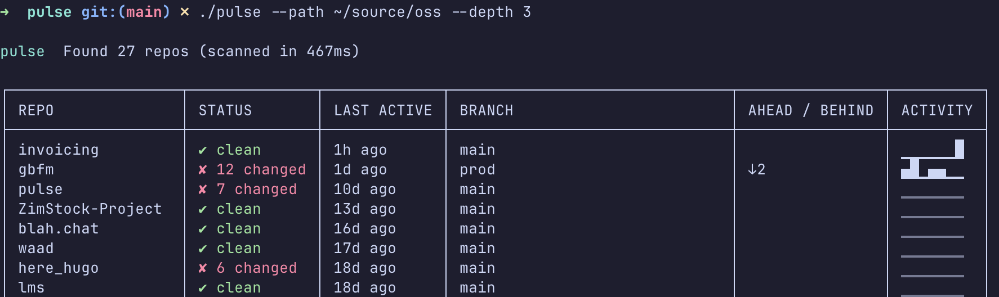
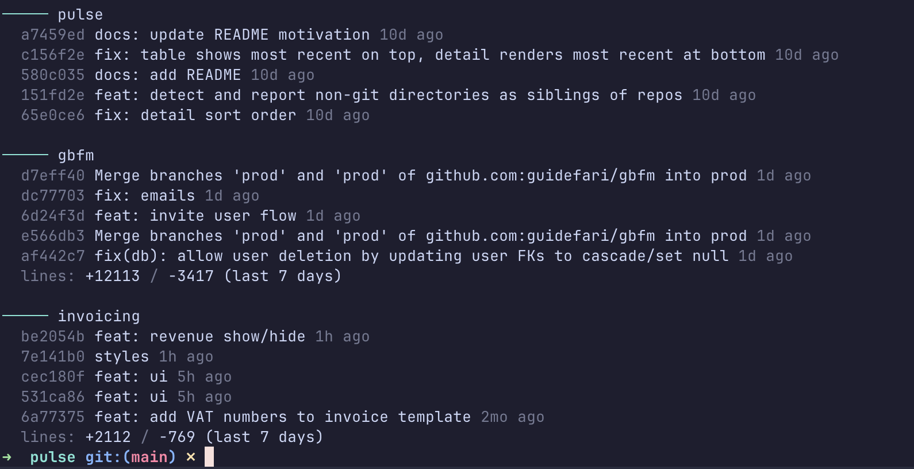

# Pulse

A CLI tool that recursively scans directories for Git repos and displays a status summary.

## Motivation

My brain runs an "Out of sight, out of mind" operation. I came back to my laptop after a day or two away, and needed a way to quickly jog my memory on what I've been working on.

## Features

- **Status overview** — repo name, branch, clean/dirty state, and last active time for every repo in a single table
- **Changed file count** — dirty repos show exactly how many files have uncommitted changes
- **Ahead/behind** — unpushed (↑) and unpulled (↓) commit counts vs `origin`, computed from local remote-tracking refs
- **Activity sparkline** — 7-day commit history rendered as `▁▂▃▄▅▆▇█` per repo in the table
- **Ghost detection** — flags repos inactive for 1+ month with 👻
- **Remote fetch** — optionally run `git fetch` before computing ahead/behind so counts reflect the actual remote state
- **Detail mode** — last 5 commits and lines added/removed (last 7 days) per repo, plus a daily commit total across all repos
- **Non-git detection** — lists directories that sit alongside repos in your tree but are not git-tracked
- **Parallel analysis** — repos are analyzed concurrently with a worker pool (4 workers by default)
- **Smart traversal** — skips `node_modules`, `vendor`, and `.Trash`; stops descending once a `.git` directory is found
- **JSON output** — full structured output, pipe to `jq` or feed to another tool
- **Performance tracing** — OpenTelemetry waterfall timeline and per-repo span tree with `--time`
- **Results sorted by recency** — most recently active repos appear at the bottom, closest to your prompt

## Screenshots

**Basic scan** — table view with status, branch, ahead/behind, and 7-day activity sparkline:



**Detail mode** — recent commits per repo with lines changed:



## Install

```bash
go install github.com/guidefari/pulse/cmd/pulse@latest
```

Or build locally:

```bash
just build
```

## Usage

```bash
pulse                                       # scan current directory, depth 3
pulse --path ~/source                       # scan a specific directory
pulse --path ~/source --depth 2             # limit traversal depth
pulse --path ~/source --detail             # recent commits + lines changed
pulse --path ~/source --fetch              # fetch remotes first, then show ahead/behind
pulse --path ~/source --format json        # JSON output
pulse --path ~/source --time               # performance breakdown
pulse --path ~/source --detail --time      # full output
```

With [just](https://github.com/casey/just):

```bash
just scan              # ~/source, depth 3
just detail            # with recent commits and lines changed
just json              # JSON output
just time              # performance waterfall
just full              # detail + time
just scan ~/projects 2 # override path and depth
```

## Flags

| Flag       | Default | Description                                                        |
| ---------- | ------- | ------------------------------------------------------------------ |
| `--path`   | `.`     | Root directory to scan for git repos                               |
| `--depth`  | `3`     | Maximum directory depth to traverse                                |
| `--detail` | `false` | Show last 5 commits and lines changed (last 7 days) per repo       |
| `--fetch`  | `false` | Run `git fetch` on each repo before computing ahead/behind counts  |
| `--format` | `table` | Output format: `table` or `json`                                   |
| `--time`   | `false` | Show OpenTelemetry performance waterfall and per-repo span tree    |

### Flag details

**`--path`**
The root directory pulse starts scanning from. Defaults to the current directory. Supports `~` expansion via the shell.

**`--depth`**
How many directory levels deep to search. A depth of `1` only looks at immediate subdirectories of `--path`. Traversal stops as soon as a `.git` directory is found, so nested repos are not double-counted.

**`--detail`**
Enables a second output block after the table showing, per repo:
- Last 5 commit hashes, messages, authors, and timestamps
- Lines added and removed in the last 7 days

Also prints a total count of commits made today across all repos.

**`--fetch`**
Before computing ahead/behind counts, runs `git fetch --quiet` on every repo. Without this flag, counts are based on local remote-tracking refs (fast, but may be stale). Use this when you want accurate counts at the cost of extra network calls.

**`--format`**
`table` (default) renders a colored terminal table. `json` emits the full `ScanResult` struct as indented JSON — useful for piping to `jq` or feeding into other tools.

**`--time`**
Renders an OpenTelemetry-backed performance breakdown after the main output:
- Total directory scan time
- Total analysis time across all repos
- Per-repo min/avg/max durations
- Waterfall chart showing parallelism
- Span tree for the slowest repo, broken down by analysis phase

## How it works

Pulse walks your directory tree with [godirwalk](https://github.com/karrick/godirwalk), finds `.git` directories, then analyzes each repo in parallel using a worker pool. It uses [go-git](https://github.com/go-git/go-git) for branch, commit, and remote status — but shells out to `git status --porcelain` for worktree status (10-20x faster).

Results are sorted oldest-first so the repos you've worked on most recently appear at the bottom, closest to your terminal prompt.

Ahead/behind counts are based on local remote-tracking refs by default. Pass `--fetch` to sync with the remote before computing them.
